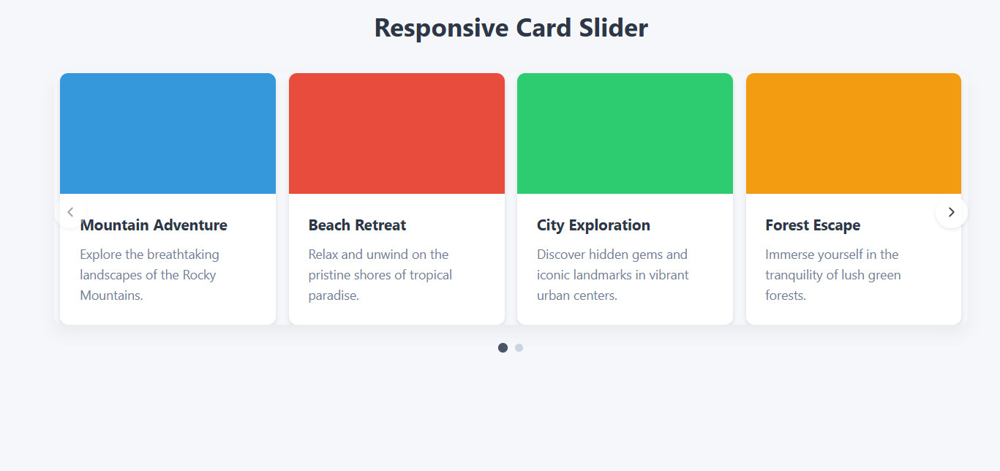

# Responsive Card Slider

A modern, lightweight responsive card slider built with vanilla JavaScript, HTML, and CSS. This slider automatically adapts to different screen sizes, showing the optimal number of cards for each viewport while maintaining smooth transitions.



## Features

- **Fully Responsive**: Automatically adjusts the number of visible cards based on screen size
- **Touch Support**: Swipe gestures on mobile devices
- **Keyboard Navigation**: Use arrow keys to navigate between slides
- **Pagination**: Visual indicator of current position with clickable dots
- **Smooth Transitions**: CSS transitions for smooth sliding effects
- **No Dependencies**: Built with vanilla JavaScript, no external libraries required
- **Optional Autoplay**: Can be enabled for automatic cycling through cards
- **Customizable**: Easily modify styles to match your project's design


1. Clone the repository:
```bash
git clone https://github.com/yourusername/responsive-card-slider.git
```

2. Open `index.html` in your browser to see the slider in action.
